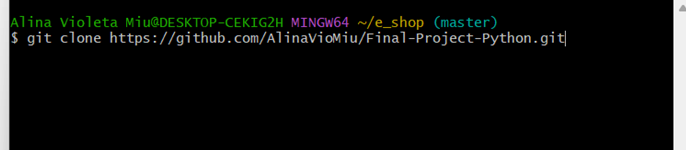
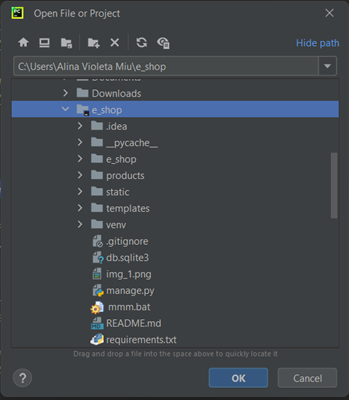
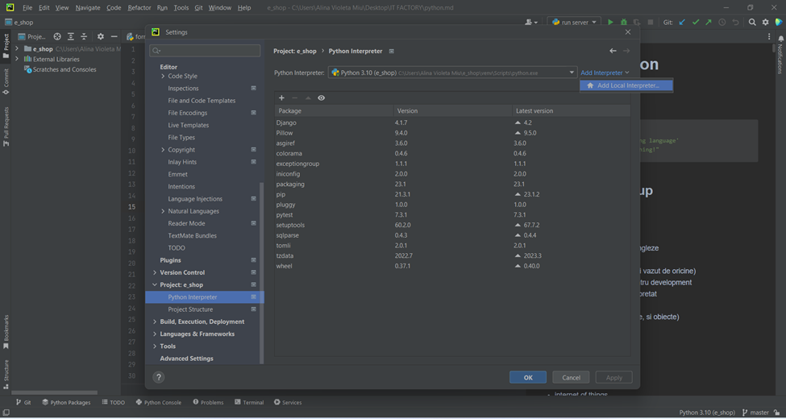
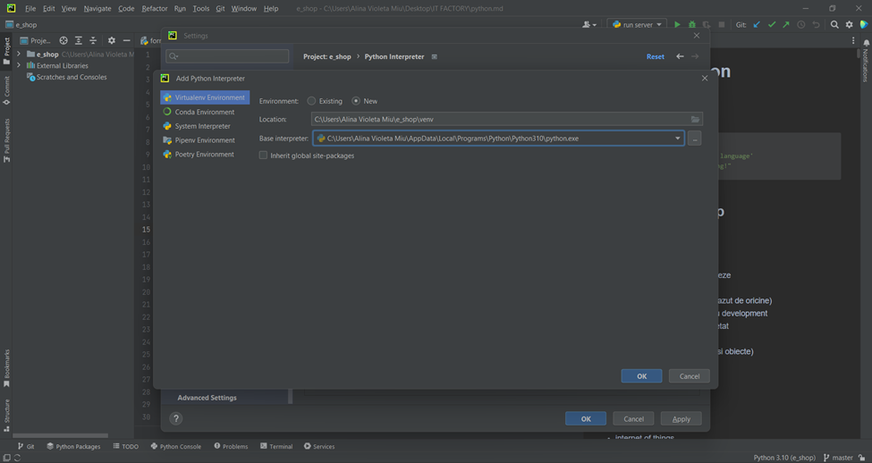
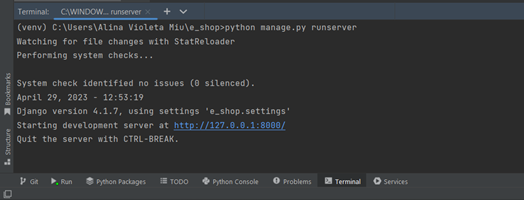

# Proiect final - Python, IT Factory

### De instalat:
[Python](https://www.python.org/downloads/) interpreter\
[PyCharm Community Edition](https://www.jetbrains.com/pycharm/download/#section=windows) IDE (Integrated Development Environment) 

### Clonare proiect:
Se creaza un folder nou in calculator unde va fi descarcat proiectul

Se copiaza din github link-ul: [https://github.com/AlinaVioMiu/Final-Project-Python.git]

Click dreapta in folderul nou creat, apoi se alege din meniu **Git Bash Here**:\
\

In terminal se da comanda `git clone https://github.com/AlinaVioMiu/Final-Project-Python.git` 

Se deschide _PyCharm_ -> File -> Open… si alegem numele folderului. Apasam **OK** si **Trust Project**

Se creaza _virtual environment_: File -> Settings...-> Project->Python Interpreter -> Add Interpreter -> Add Local Interpreter -> click **OK**

## Rulare proiect:
In terminalul Pycharm instalam urmatoarele pachete:\
	`pip install Django`\
	`pip install pillow`

Pornirea serverului: in terminal, dam comanda:\
	`python manage.py runserver`

Se acceseaza: [http://127.0.0.1:8000/]

